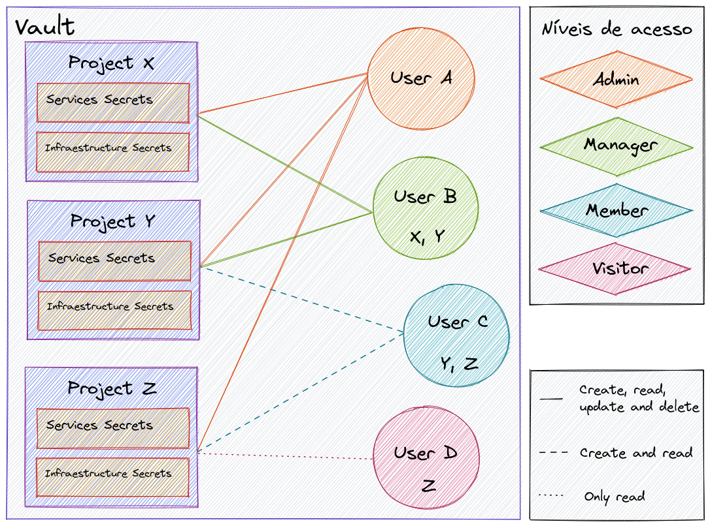

# Vault with Terraform

This is a Terraform configuration set up for HashiCorp Vault on AWS and it's designed with a small infrastructure in mind. This is not the best solution for high availability and it's best suited for small companies and personal use.

## Provisioning and setting up ACL for Vault using Terraform

This was build as a two part article in partnership with [ZRP](https://github.com/zrpaplicacoes)

* [**Part 1: Provisioning Vault using Terraform**](https://techblog.zrp.com.br/hashicorp-vault-at-aws-using-terraform-infra-as-code-6ec917a10dfc)

    The first part of the article handles the infrastructure itself.

    It explains how to build everything you need to get Vault up and running using S3 for backend, KMS for Auto-unsealing, hosted on ECS using the [official Docker image](https://hub.docker.com/_/vault) with EC2 spot instances (spot for cost reduction) that register into the ECS Cluster.

* [**Part 2: Setting up Access Control Policy (ACL) in Vault using Terraform**](https://techblog.zrp.com.br/configurando-pol%C3%ADtica-de-controle-de-acesso-no-hashicorp-vault-utilizando-terraform-7c1beb7938bf)

    The second part of the article handles Vault internal configuration using Vault Terraform provider.

    It explains how to create policies for multiple projects taking into consideration 4 different access levels: **admin**, **management**, **member** and **visitor**, and also how to create users and attach the necessary policies to them, all using only Terraform, Vault UI is only used for validation.

    The image bellow illustrates the 4 mentioned level of access for the policies. Each project will have a policy of each kind (minus **admin** which is global).

    

## How to use this repository?

All the code in this repository was build gradually, if you try to apply it as is **it will not work**,  you will get an error from Terraform.

Use this **as a reference** or read [the articles](#provisioning-and-setting-up-acl-for-vault-using-terraform) for more information about how you can make this works.
