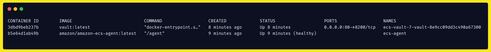

# Vault with Terraform (W.I.P.)

> :warning: This is still a working in progress :warning:

This is a Terraform configuration file for HashiCorp Vault on AWS that uses the Docker image and it's designed with a small infrastructure in mind. This is not the best solution for high availability and it's best suited for small companies and personal use.

## What does it build?

The `main.tf` file when applied will add the following configuration to your infrastructure:

* 1 IAM Policy for KMS Management
* 2 IAM Roles, 1 for Vault's Task Definition and 1 for ECS Cluster's instance
* 1 S3 Bucket that will serve as [storage for Vault](https://www.vaultproject.io/docs/configuration/storage/s3)
* 1 KMS Key for [Vault's Auto Unsealing](https://www.vaultproject.io/docs/concepts/seal#auto-unseal)
* 7 SSM Parameters for Vault's Task Definition environment variables
* 1 Security Group for the ECS Cluster's instance
* 1 Task Definition for Vault container
* 1 ECS Cluster
* 1 Service for running the Task Definition on the Cluster
* 1 Spot Fleet Request that will attach the instance to the ECS Cluster
<!-- * 1 Target group to be [attached to a Load Balancer Listener's rule](https://docs.aws.amazon.com/elasticloadbalancing/latest/application/load-balancer-listeners.html) (manually) -->

This is the resulting [graph](https://www.terraform.io/docs/internals/graph.html):


## Prerequisites

To use this template you will need

* The [Terraform CLI](https://learn.hashicorp.com/tutorials/terraform/install-cli) installed
* The [AWS CLI](https://docs.aws.amazon.com/cli/latest/userguide/install-cliv2.html) installed
* An [AWS account](https://aws.amazon.com/free/)
* The [AWS CLI configured](https://docs.aws.amazon.com/cli/latest/userguide/cli-chap-configure.html)

## Instructions for use

1. Change the values of the variables in `terraform.tfvars` for values that suits your context

    `profile`: The [named profile](https://docs.aws.amazon.com/cli/latest/userguide/cli-configure-profiles.html) configured in the AWS CLI. If no profile was set up just leave it as `default`

    `account_id`: The [AWS ID account](https://docs.aws.amazon.com/IAM/latest/UserGuide/console_account-alias.html#FindingYourAWSId) in which Vault will be provided

    `vpc_id`: The default [VPC](https://docs.aws.amazon.com/vpc/latest/userguide/what-is-amazon-vpc.html) id in which Vault resources will be provided

    `bucker_name`: The name of the S3 Bucket that will serve as [storage for Vault](https://www.vaultproject.io/docs/configuration/storage/s3). Beware the S3 [naming rules](https://docs.aws.amazon.com/AmazonS3/latest/userguide/bucketnamingrules.html)

2. Remove the lock file

    ```sh
    rm .terraform.lock.hcl
    ```

3 Remove custom cloud config from `main.tf` at `line 20`

  

4. Go in the AWS console and [create and download a key pair](https://docs.aws.amazon.com/AWSEC2/latest/UserGuide/ec2-key-pairs.html#having-ec2-create-your-key-pair) **named `vault-key`** that will be used by to ssh into the instance

5. Run `terraform init` on the root of this repository

6. Run `terraform plan` to preview what will be built and run `terraform apply` to provision it

7. [Connect to the instance](https://docs.aws.amazon.com/AWSEC2/latest/UserGuide/AccessingInstancesLinux.html) through SSH

8. List the running containers with `docker ps`, the output will look something like this:

    

    Take note of the first 3 digits of the Vault container's id

9. Enter the container

    ```sh
    docker exec -it 3db sh
    ```

    Where `3db` is the id retrieved from `docker ps` command on the previous step

10. Run the following command

    ```sh
    vault operator init
    ```

    Which will generate an output like the following

    

    Write this information on a piece of paper and keep it with your life. You can now close your ssh connection with the instance

11. Access the Vault UI via the EC2 instance DNS and [start using it](https://learn.hashicorp.com/collections/vault/getting-started-ui)
